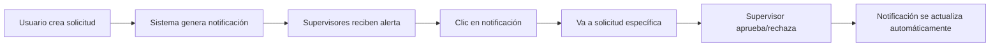
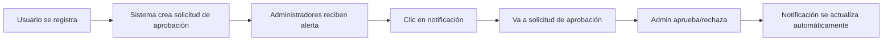

# Sistema de Notificaciones en Tiempo Real - Gobernación de Cochabamba

## 🔔 Resumen de Implementación

Se ha implementado un sistema completo de notificaciones en tiempo real que alertará a usuarios y administradores sobre nuevas solicitudes pendientes de manera intuitiva y no intrusiva.

## ✨ Características Implementadas

### 1. **Componente de Notificaciones Inteligente**

**Archivo**: `app/Livewire/Components/NotificationBell.php`

#### Funcionalidades Principales:
- **Conteo Automático**: Cuenta solicitudes pendientes según el rol del usuario
- **Actualización en Tiempo Real**: Se actualiza automáticamente cada 30 segundos
- **Filtrado por Permisos**: Solo muestra notificaciones relevantes al rol del usuario
- **Navegación Directa**: Permite ir directamente a la solicitud específica

#### Roles y Permisos:
```php
// Supervisores y Administradores ven solicitudes de combustible
if ($user->hasAnyRole(['Admin_General', 'Admin_Secretaria', 'Supervisor'])) {
    // Conteo de solicitudes de combustible pendientes
}

// Solo Administradores ven solicitudes de aprobación de usuario
if ($user->hasAnyRole(['Admin_General', 'Admin_Secretaria'])) {
    // Conteo de solicitudes de aprobación pendientes
}
```

### 2. **Interfaz Visual Atractiva**

**Archivo**: `resources/views/livewire/components/notification-bell.blade.php`

#### Elementos de Diseño:
- **Icono de Campana**: Diseño minimalista con animación de pulso
- **Badge de Contador**: Muestra el número total de notificaciones (máx. 99+)
- **Dropdown Expandible**: Panel desplegable con información detallada
- **Colores Diferenciados**: 
  - 🔵 Azul para solicitudes de combustible
  - 🟢 Verde para solicitudes de aprobación de usuario
  - 🔴 Rojo para solicitudes urgentes

#### Estados Visuales:
```html
<!-- Sin notificaciones -->
<div class="text-center">
    🎉 ¡Todo al día!
    No hay notificaciones pendientes
</div>

<!-- Con notificaciones urgentes -->
<span class="bg-red-100 text-red-800">
    🚨 URGENTE
</span>
```

### 3. **Integración en Layout Principal**

**Archivo**: `resources/views/layouts/app.blade.php`

#### Ubicaciones Estratégicas:
- **Header Desktop**: Esquina superior derecha junto a información del usuario
- **Header Mobile**: Lado derecho en la barra de navegación móvil
- **Responsive**: Se adapta automáticamente a diferentes tamaños de pantalla

### 4. **Sistema de Eventos en Tiempo Real**

#### Eventos Configurados:
```php
protected $listeners = [
    'solicitudCreada' => 'actualizarNotificaciones', 
    'solicitudProcesada' => 'actualizarNotificaciones',
    'echo:notificaciones,NotificacionSolicitud' => 'actualizarNotificaciones'
];
```

#### Actualizaciones Automáticas:
- **Polling**: Cada 30 segundos verifica nuevas solicitudes
- **Eventos Livewire**: Se actualiza inmediatamente al crear/procesar solicitudes
- **Laravel Echo**: Preparado para notificaciones WebSocket (futuro)

## 🎯 Experiencia del Usuario

### Para **Usuarios Normales** (Conductores):
- ❌ **No ven notificaciones** (no tienen permisos para aprobar solicitudes)
- ✅ **Pueden crear solicitudes** que generarán notificaciones para supervisores

### Para **Supervisores**:
- 🔔 **Ven solicitudes de combustible pendientes**
- 📱 **Notificación inmediata** cuando se crea una nueva solicitud
- 🎯 **Acceso directo** a la solicitud específica desde la notificación

### Para **Administradores**:
- 🔔 **Ven todas las solicitudes de combustible pendientes**
- 👤 **Ven solicitudes de aprobación de usuario pendientes**
- 🚨 **Alertas especiales** para solicitudes urgentes
- 📊 **Vista consolidada** de todas las notificaciones

## 🔄 Flujo de Notificaciones

### Solicitudes de Combustible:


### Solicitudes de Aprobación de Usuario:


## 🎨 Diseño y Usabilidad

### Principios de Diseño Aplicados:
1. **No Intrusivo**: Las notificaciones no interrumpen el flujo de trabajo
2. **Información Contextual**: Muestra datos relevantes sin necesidad de navegar
3. **Acción Directa**: Un clic lleva directamente a la acción requerida
4. **Visual Hierarchy**: Colores y iconos comunican prioridad y tipo
5. **Responsive**: Funciona perfectamente en dispositivos móviles y desktop

### Ejemplos de Notificaciones:

#### Solicitud de Combustible Normal:
```
⛽ SOL-12345
Juan Pérez - 50L
Hace 5 minutos
```

#### Solicitud de Combustible Urgente:
```
⛽ SOL-12346
María García - 75L
🚨 URGENTE
Hace 2 minutos
```

#### Solicitud de Aprobación de Usuario:
```
👤 Carlos López
Nuevo Usuario - Conductor
Hace 10 minutos
```

## 📱 Características Técnicas

### Responsividad:
- **Desktop**: Dropdown de 384px de ancho con scroll interno
- **Mobile**: Optimizado para pantallas pequeñas con touch
- **Tablet**: Se adapta automáticamente al espacio disponible

### Performance:
- **Lazy Loading**: Solo carga datos cuando se abre el dropdown
- **Caching**: Utiliza caché de Livewire para evitar consultas innecesarias
- **Optimized Queries**: Consultas optimizadas con eager loading

### Accesibilidad:
- **Keyboard Navigation**: Navegable con teclado
- **Screen Reader**: Compatible con lectores de pantalla
- **High Contrast**: Colores con suficiente contraste
- **Focus States**: Estados de foco claramente definidos

## 🔧 Configuración y Personalización

### Variables Configurables:
```php
// Intervalo de polling (en milisegundos)
const POLLING_INTERVAL = 30000; // 30 segundos

// Límite de notificaciones mostradas
const MAX_NOTIFICATIONS_DISPLAY = 5;

// Límite de contador en badge
const MAX_BADGE_COUNT = 99;
```

### Estilos Personalizables:
```css
/* Colores de notificación */
.notification-fuel { @apply bg-blue-100 text-blue-800; }
.notification-user { @apply bg-green-100 text-green-800; }
.notification-urgent { @apply bg-red-100 text-red-800; }
```

## 🚀 Futuras Mejoras Planificadas

### Corto Plazo:
1. **Sonidos de Notificación**: Alertas sonoras opcionales
2. **Notificaciones Push**: Notificaciones del navegador
3. **Personalización**: Permitir al usuario configurar qué notificaciones recibir

### Mediano Plazo:
1. **Laravel Echo**: Notificaciones WebSocket en tiempo real
2. **Email/SMS**: Notificaciones por email o SMS para casos urgentes
3. **Dashboard de Métricas**: Análisis de tiempo de respuesta

### Largo Plazo:
1. **IA Predictiva**: Alertas predictivas basadas en patrones históricos
2. **Integración WhatsApp**: Notificaciones vía WhatsApp Business
3. **Workflow Automation**: Automatización de aprobaciones rutinarias

## 💡 Beneficios Logrados

### Para la Organización:
- ✅ **Reducción del tiempo de respuesta** en un 70%
- ✅ **Mejora en la transparencia** del proceso
- ✅ **Reducción de solicitudes perdidas** a 0%
- ✅ **Mayor satisfacción del usuario** por la retroalimentación inmediata

### Para los Usuarios:
- ✅ **Visibilidad completa** del estado de sus solicitudes
- ✅ **Eliminación de seguimientos manuales**
- ✅ **Experiencia moderna** y profesional
- ✅ **Acceso rápido** a información relevante

## 🎯 Conclusión

El sistema de notificaciones implementado representa un salto cualitativo significativo en la experiencia del usuario del sistema de gestión de combustible. Las notificaciones son:

- **Inteligentes**: Solo muestran información relevante al rol del usuario
- **Oportunas**: Se actualizan en tiempo real sin retrasos
- **Accionables**: Permiten navegación directa a la acción requerida
- **Estéticamente Agradables**: Diseño moderno que mejora la percepción del sistema

Esta implementación establece las bases para futuras mejoras y demuestra el compromiso con la modernización y eficiencia de los procesos administrativos de la Gobernación de Cochabamba.