# Diagramas de Flujo del Sistema - Gobernación de Cochabamba

## 1. Flujo de Registro de Usuario con WhatsApp

```mermaid
flowchart TD
    A[👤 Admin/Supervisor] --> B[🔑 Generar Código de Registro]
    B --> C[💾 Guardar en BD<br/>codigos_registro]
    C --> D[📋 Mostrar código al Admin]
    
    E[👤 Usuario Nuevo] --> F[📝 Completar Formulario<br/>de Pre-registro]
    F --> G{🔍 ¿Código válido<br/>y vigente?}
    G -->|❌ No| H[⚠️ Error: Código inválido]
    G -->|✅ Sí| I[💾 Crear solicitud<br/>solicitudes_aprobacion_usuario]
    
    I --> J[🔄 Marcar código como usado]
    J --> K[📱 Enviar WhatsApp<br/>al usuario creador del código]
    
    K --> L[📲 Usuario recibe notificación<br/>con enlace de aprobación]
    L --> M[🔗 Clic en enlace de WhatsApp]
    M --> N{🛡️ ¿Token válido<br/>y no expirado?}
    N -->|❌ No| O[⚠️ Error: Enlace expirado]
    N -->|✅ Sí| P[📋 Mostrar formulario<br/>de aprobación]
    
    P --> Q{📝 ¿Aprobar o<br/>rechazar?}
    Q -->|✅ Aprobar| R[👤 Crear usuario en BD<br/>tabla usuarios]
    Q -->|❌ Rechazar| S[❌ Marcar solicitud<br/>como rechazada]
    
    R --> T[🔐 Generar contraseña<br/>temporal]
    T --> U[📱 Enviar credenciales<br/>por WhatsApp/Email]
    U --> V[✅ Usuario puede<br/>acceder al sistema]
    
    S --> W[❌ Proceso terminado<br/>Usuario no creado]
```

## 2. Flujo de Solicitud de Combustible

```mermaid
flowchart TD
    A[👤 Conductor/Usuario] --> B[🚗 Seleccionar Vehículo<br/>Asignado]
    B --> C[📝 Completar Solicitud<br/>de Combustible]
    C --> D[💾 Guardar en BD<br/>solicitudes_combustible]
    
    D --> E{🔍 Validaciones<br/>Automáticas}
    E --> F[💰 ¿Presupuesto disponible?]
    E --> G[⛽ ¿Capacidad del tanque?]
    E --> H[📊 ¿Rendimiento histórico?]
    
    F -->|❌| I[⚠️ Error: Sin presupuesto]
    G -->|❌| J[⚠️ Error: Excede capacidad]
    H -->|❌| K[⚠️ Warning: Rendimiento anómalo]
    
    F -->|✅| L[📩 Notificar a Supervisor]
    G -->|✅| L
    H -->|✅| L
    K --> L
    
    L --> M[👨‍💼 Supervisor revisa solicitud]
    M --> N{📋 ¿Aprobar<br/>solicitud?}
    
    N -->|❌ Rechazar| O[❌ Marcar como rechazada<br/>+ observaciones]
    N -->|✅ Aprobar| P[✅ Marcar como aprobada<br/>+ observaciones]
    
    P --> Q[📩 Notificar a Operador<br/>de Despacho]
    Q --> R[⚙️ Operador registra<br/>despacho real]
    R --> S[💾 Guardar en BD<br/>despachos_combustible]
    
    S --> T[💰 Actualizar presupuesto<br/>automáticamente]
    T --> U[📊 Trigger actualiza<br/>totales gastados]
    U --> V[✅ Solicitud completada<br/>Estado: Despachada]
    
    O --> W[❌ Proceso terminado<br/>Sin despacho]
```

## 3. Flujo de Control de Consumo

```mermaid
flowchart TD
    A[👤 Conductor] --> B[🚗 Finalizar recorrido<br/>con vehículo]
    B --> C[📝 Registrar Consumo<br/>Real de Combustible]
    
    C --> D[📊 Ingresar datos:]
    D --> E[📍 Kilometraje inicial]
    D --> F[📍 Kilometraje final]
    D --> G[⛽ Observaciones del viaje]
    
    E --> H[💾 Guardar en BD<br/>consumos_combustible]
    F --> H
    G --> H
    
    H --> I[🔄 Trigger automático:<br/>Calcular rendimiento]
    I --> J[📈 km_recorridos ÷ litros_cargados]
    J --> K[🔄 Actualizar kilometraje<br/>del vehículo]
    
    K --> L{📊 ¿Rendimiento<br/>dentro de rango normal?}
    L -->|✅ Normal| M[✅ Registro validado<br/>automáticamente]
    L -->|⚠️ Anómalo| N[🚨 Generar alerta<br/>para supervisor]
    
    N --> O[📩 Notificar a supervisor<br/>para revisión manual]
    O --> P[👨‍💼 Supervisor revisa<br/>consumo anómalo]
    P --> Q{🔍 ¿Validar<br/>consumo?}
    
    Q -->|✅ Validar| R[✅ Marcar como validado<br/>consumo normal]
    Q -->|❌ Rechazar| S[❌ Investigar posible<br/>irregularidad]
    
    M --> T[📊 Actualizar estadísticas<br/>de rendimiento del vehículo]
    R --> T
    T --> U[✅ Proceso completado]
    
    S --> V[🔍 Iniciar proceso<br/>de auditoría]
```

## 4. Flujo de Control Presupuestario

```mermaid
flowchart TD
    A[💰 Sistema de Presupuesto] --> B[📊 Monitoreo en Tiempo Real]
    B --> C[💾 Consultar tabla<br/>presupuestos]
    
    C --> D[📈 Calcular porcentajes:]
    D --> E[💸 Total gastado ÷ Presupuesto inicial]
    D --> F[💼 Total comprometido]
    D --> G[💰 Presupuesto disponible]
    
    E --> H{🚨 ¿Nivel de<br/>ejecución?}
    H -->|< 70%| I[🟢 Estado Normal<br/>Sin alertas]
    H -->|70-85%| J[🟡 Alerta Preventiva<br/>Notificar supervisores]
    H -->|85-95%| K[🟠 Alerta Crítica<br/>Notificar administradores]
    H -->|> 95%| L[🔴 Alerta Máxima<br/>Bloquear nuevas solicitudes]
    
    J --> M[📧 Enviar notificación<br/>por email/WhatsApp]
    K --> M
    L --> M
    
    M --> N[📊 Actualizar dashboard<br/>con alertas visibles]
    N --> O[📈 Generar reporte<br/>automático semanal]
    
    O --> P[📩 Enviar reporte a:<br/>- Admin General<br/>- Admin Secretaría<br/>- Supervisores]
    
    I --> Q[✅ Continuar operación<br/>normal]
    P --> Q
    
    L --> R[🚫 Bloquear sistema<br/>para nuevas solicitudes]
    R --> S[📞 Requiere intervención<br/>manual del Admin General]
```

## 5. Flujo de Auditoría y Trazabilidad

```mermaid
flowchart TD
    A[🎯 Cualquier Acción<br/>en el Sistema] --> B[📊 Trigger Automático<br/>de Auditoría]
    
    B --> C[📝 Capturar Información:]
    C --> D[👤 Usuario que ejecuta]
    C --> E[⏰ Fecha y hora exacta]
    C --> F[🎯 Tipo de acción]
    C --> G[📊 Tabla afectada]
    C --> H[📋 Registro específico]
    C --> I[🌐 IP de origen]
    C --> J[💾 Datos antes/después]
    
    D --> K[💾 Insertar en BD<br/>registro_auditoria]
    E --> K
    F --> K
    G --> K
    H --> K
    I --> K
    J --> K
    
    K --> L[📊 Análisis Automático<br/>de Patrones]
    L --> M{🔍 ¿Detectar<br/>anomalías?}
    
    M -->|❌ Normal| N[✅ Registro normal<br/>Continuar]
    M -->|⚠️ Sospechoso| O[🚨 Generar alerta<br/>de seguridad]
    
    O --> P[📧 Notificar a<br/>Admin General]
    P --> Q[🔒 Posible bloqueo<br/>temporal del usuario]
    Q --> R[🔍 Revisión manual<br/>requerida]
    
    N --> S[📈 Generar reportes<br/>periódicos]
    S --> T[📊 Dashboard de<br/>actividad del sistema]
    T --> U[📋 Reportes disponibles:<br/>- Diario<br/>- Semanal<br/>- Mensual<br/>- Por usuario<br/>- Por acción]
```

## 6. Flujo de Roles y Permisos (Spatie)

```mermaid
flowchart TD
    A[👤 Usuario Autenticado] --> B[🔍 Sistema verifica<br/>rol del usuario]
    
    B --> C{👔 ¿Qué rol<br/>tiene?}
    
    C -->|🏛️| D[Admin_General<br/>Acceso total]
    C -->|🏢| E[Admin_Secretaria<br/>Gestión de su secretaría]
    C -->|👨‍💼| F[Supervisor<br/>Aprobación de solicitudes]
    C -->|🚗| G[Conductor<br/>Crear solicitudes]
    C -->|⚙️| H[Operator<br/>Despachar combustible]
    
    D --> I[✅ Permisos disponibles:<br/>- Gestionar usuarios<br/>- Generar códigos<br/>- Ver todos los reportes<br/>- Configurar presupuestos<br/>- Acceso total a auditoría]
    
    E --> J[✅ Permisos disponibles:<br/>- Gestionar usuarios de su unidad<br/>- Aprobar solicitudes<br/>- Ver reportes de su secretaría<br/>- Gestionar proveedores]
    
    F --> K[✅ Permisos disponibles:<br/>- Aprobar solicitudes de su área<br/>- Generar códigos de registro<br/>- Ver reportes de vehículos<br/>- Gestionar conductores]
    
    G --> L[✅ Permisos disponibles:<br/>- Crear solicitudes<br/>- Registrar consumo<br/>- Ver historial de sus vehículos<br/>- Actualizar kilometrajes]
    
    H --> M[✅ Permisos disponibles:<br/>- Registrar despachos<br/>- Gestionar proveedores<br/>- Generar reportes operativos<br/>- Validar consumos]
    
    I --> N[🎯 Ejecutar acción<br/>solicitada]
    J --> N
    K --> N
    L --> N
    M --> N
    
    N --> O[📊 Registrar en<br/>auditoría]
    O --> P[✅ Acción completada<br/>con trazabilidad]
```

## 7. Arquitectura General del Sistema

```mermaid
graph TB
    subgraph "Frontend - Livewire"
        A[📱 Interfaz de Usuario]
        B[🔄 Componentes Reactivos]
        C[📊 Dashboard en Tiempo Real]
    end
    
    subgraph "Backend - Laravel 12"
        D[🎯 Controladores]
        E[📋 Modelos Eloquent]
        F[🔒 Middleware de Auth]
        G[📧 Servicios de Notificación]
        H[⚙️ Jobs en Cola]
    end
    
    subgraph "Autenticación"
        I[🔐 Laravel Breeze]
        J[👔 Spatie Roles]
        K[🛡️ Permisos]
    end
    
    subgraph "Base de Datos"
        L[🗄️ MySQL 8.0]
        M[📊 Triggers Automáticos]
        N[📈 Vistas Optimizadas]
        O[🔍 Índices de Rendimiento]
    end
    
    subgraph "Servicios Externos"
        P[📱 WhatsApp API]
        Q[📧 Email SMTP]
        R[☁️ Storage en la Nube]
    end
    
    subgraph "Infraestructura"
        S[🐳 Laravel Sail]
        T[🌐 Nginx]
        U[📊 Redis Cache]
        V[🔄 Queue Workers]
    end
    
    A --> D
    B --> D
    C --> D
    D --> E
    D --> F
    E --> L
    F --> I
    I --> J
    J --> K
    G --> P
    G --> Q
    H --> V
    M --> L
    N --> L
    O --> L
    S --> T
    S --> U
    S --> V
```

## 8. Flujo de Notificaciones WhatsApp

```mermaid
sequenceDiagram
    participant U as Usuario Nuevo
    participant S as Sistema
    participant DB as Base de Datos
    participant W as WhatsApp API
    participant A as Admin/Supervisor
    
    U->>S: 1. Envía formulario de registro
    S->>DB: 2. Valida código de registro
    DB-->>S: 3. Código válido
    S->>DB: 4. Crea solicitud de aprobación
    S->>DB: 5. Marca código como usado
    
    S->>W: 6. Envía mensaje de notificación
    Note over W: Mensaje con datos del solicitante
    W->>A: 7. Entrega notificación WhatsApp
    
    S->>W: 8. Envía enlace de aprobación
    Note over W: Enlace seguro con token
    W->>A: 9. Entrega enlace WhatsApp
    
    A->>S: 10. Hace clic en enlace
    S->>S: 11. Valida token de seguridad
    S-->>A: 12. Muestra formulario de aprobación
    
    A->>S: 13. Envía decisión (aprobar/rechazar)
    
    alt Aprobación
        S->>DB: 14a. Crea usuario en sistema
        S->>W: 15a. Envía credenciales por WhatsApp
        W->>U: 16a. Usuario recibe credenciales
    else Rechazo
        S->>DB: 14b. Marca solicitud como rechazada
        S->>W: 15b. Notifica rechazo
        W->>U: 16b. Usuario recibe notificación de rechazo
    end
```

Estos diagramas proporcionan una visualización clara y detallada de todos los flujos del sistema, facilitando la comprensión del funcionamiento y la implementación del proyecto para la Gobernación de Cochabamba.
